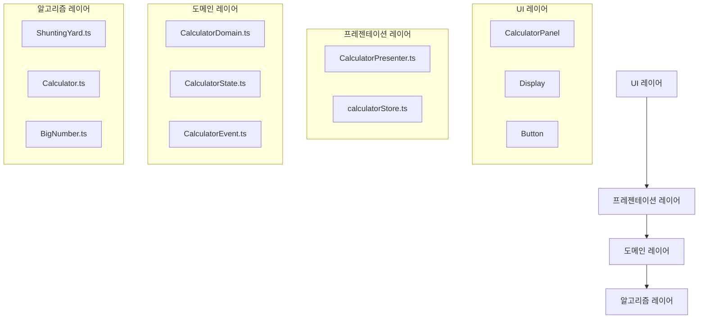
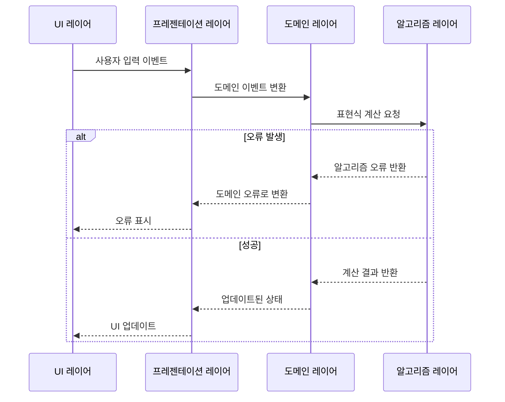

# 모던 계산기 애플리케이션


## 개요

이 프로젝트는 관심사 분리, 도메인 주도 설계, 유지보수 가능한 코드 구조에 중점을 둔 클린 아키텍처 접근 방식으로 구축된 현대적인 계산기 애플리케이션입니다. 이 계산기는 표준 산술 연산, 큰 숫자에 대한 정밀 계산을 지원하며, 0으로 나누기 및 표현식 유효성 검사와 같은 예외 상황을 처리합니다.

## 아키텍처

애플리케이션은 다음과 같은 명확한 레이어가 있는 클린 아키텍처 패턴을 따릅니다:



### 도메인 레이어

도메인 레이어는 계산기의 핵심 비즈니스 로직을 포함합니다:

- **CalculatorDomain.ts**: 계산기 작업을 위한 도메인 로직 구현
- **CalculatorState.ts**: 상태 구조 및 타입 정의
- **CalculatorEvent.ts**: 계산기 도메인 내에서 트리거될 수 있는 이벤트 정의

### 알고리즘 레이어

알고리즘 레이어는 도메인 관심사와 분리된 수학적 알고리즘을 포함합니다:

- **ShuntingYard.ts**: 중위 표현식을 후위 표기법으로 변환하기 위한 Shunting Yard 알고리즘 구현
- **Calculator.ts**: 표현식 평가 및 계산 오류 처리를 위한 로직 포함
- **BigNumber.ts**: 대규모 숫자 및 높은 정밀도가 필요한 연산을 위한 정밀 계산 제공

### 프레젠테이션 레이어

- **CalculatorPresenter.ts**: 도메인 레이어를 UI에 연결하여 사용자 상호작용 및 상태 업데이트 처리
- **calculatorStore.ts**: 계산기 상태를 관리하고 UI 컴포넌트에 필요한 인터페이스 제공

### UI 레이어

- **CalculatorPanel**: 계산기 UI의 메인 컴포넌트로, 디스플레이와 버튼을 관리
- **Display.tsx**: 계산기 화면을 렌더링하고 현재 입력 또는 결과값 표시
- **Button**: 숫자 및 연산자 입력을 위한 버튼 컴포넌트

## 주요 설계 원칙

1. **관심사 분리**: 도메인 로직이 알고리즘 및 프레젠테이션 로직과 명확하게 분리됨
2. **오류 처리**: 알고리즘 오류와 도메인 오류가 구분되며, 둘 사이의 변환을 위한 매핑 함수 제공
3. **순수 함수**: 핵심 알고리즘은 더 나은 테스트 가능성과 유지보수를 위해 순수 함수로 구현됨
4. **도메인 주도 설계**: 구조가 명확한 경계를 가진 계산기의 도메인 모델을 반영함

5. **단일 책임 원칙**: 각 컴포넌트는 시스템 내에서 명확하고 단일한 책임을 가짐

## 오류 처리 흐름



## 테스트 커버리지

애플리케이션은 다음에 대한 포괄적인 테스트 커버리지를 포함합니다:

- 도메인 로직
- 수학적 알고리즘
- UI 컴포넌트
- 예외 상황 (0으로 나누기, 큰 숫자 등)

## 시작하기

### 설치

```
yarn install
```

### 애플리케이션 실행

```
yarn dev
```

### 테스트 실행

```
yarn test
```
