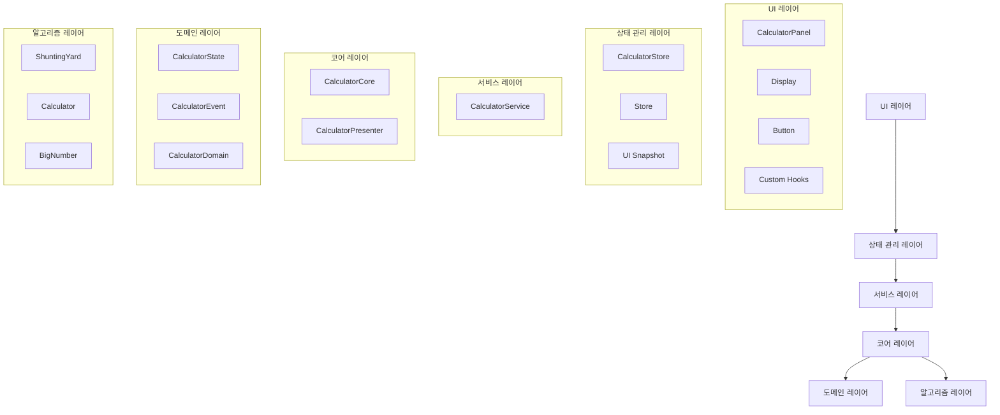
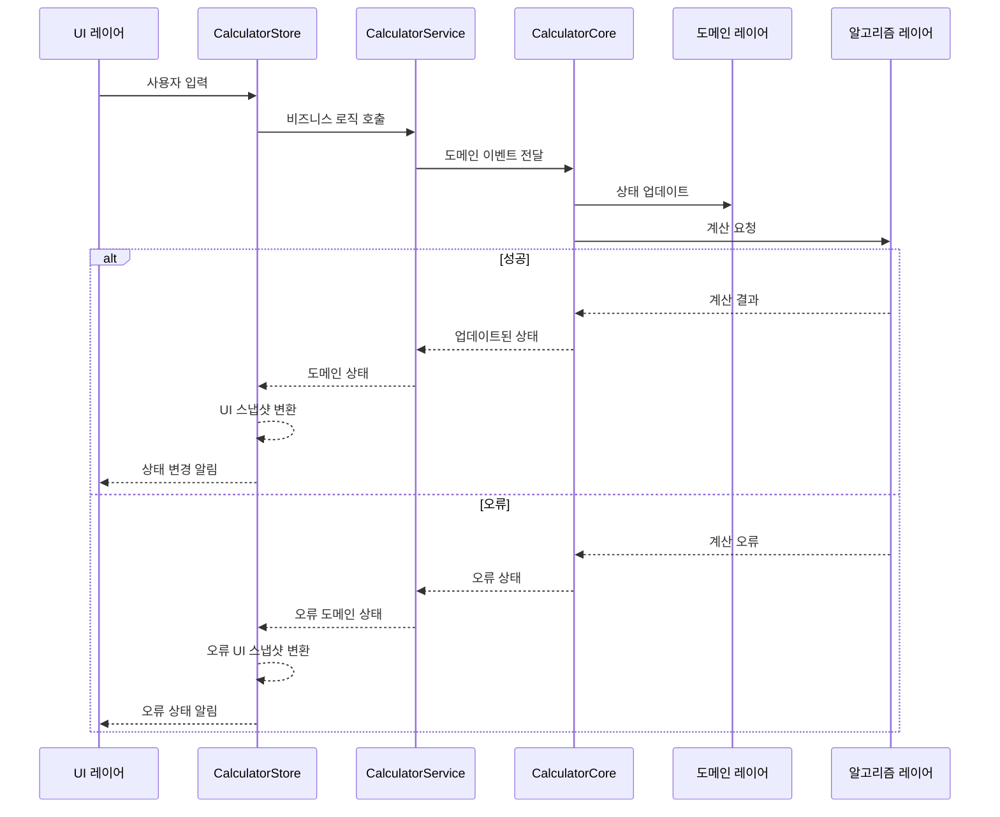

# 모던 계산기 애플리케이션


## 개요

이 프로젝트는 관심사 분리, 도메인 주도 설계, 유지보수 가능한 코드 구조에 중점을 둔 클린 아키텍처 접근 방식으로 구축된 현대적인 계산기 애플리케이션입니다. 이 계산기는 표준 산술 연산, 큰 숫자에 대한 정밀 계산을 지원하며, 0으로 나누기 및 표현식 유효성 검사와 같은 예외 상황을 처리합니다.

## 아키텍처

애플리케이션은 다음과 같은 명확한 레이어가 있는 클린 아키텍처 패턴을 따릅니다:



### UI 레이어

사용자 인터페이스와 상호작용을 담당합니다:

- **CalculatorPanel**: 메인 계산기 컴포넌트
- **Display**: 계산기 화면 표시
- **Button**: 입력 버튼 컴포넌트
- **Custom Hooks**: UI 상태 관리 및 키보드 입력 처리

### 상태 관리 레이어

애플리케이션 상태와 구독/알림 패턴을 담당합니다:

- **Store<T>**: 범용 상태 관리 기반 클래스 (구독/알림 패턴)
- **CalculatorStore**: 계산기 전용 상태 관리 및 UI 스냅샷 변환
- **UI Snapshot**: UI에 최적화된 데이터 형식

### 서비스 레이어

비즈니스 로직을 담당합니다:

- **CalculatorService**: 순수한 비즈니스 로직 처리 및 Core와의 상호작용

### 코어 레이어

도메인 로직과 표현 로직을 담당합니다:

- **CalculatorCore**: 도메인 이벤트 처리 및 상태 관리
- **CalculatorPresenter**: 도메인 상태를 UI 표시 형식으로 변환하는 순수 함수

### 도메인 레이어

계산기의 핵심 비즈니스 규칙을 포함합니다:

- **CalculatorState**: 상태 구조 및 타입 정의
- **CalculatorEvent**: 도메인 이벤트 정의
- **CalculatorDomain**: 도메인 로직 구현

### 알고리즘 레이어

수학적 계산 알고리즘을 포함합니다:

- **ShuntingYard**: 중위 표현식을 후위 표기법으로 변환
- **Calculator**: 표현식 평가 및 계산 오류 처리
- **BigNumber**: 고정밀 수치 계산

## 주요 설계 원칙

1. **관심사 분리**: 각 레이어가 명확한 책임을 가짐
2. **단일 책임 원칙**: 각 클래스와 모듈이 하나의 책임만 담당
3. **의존성 역전**: 상위 레이어가 하위 레이어에 의존
4. **순수 함수**: 핵심 알고리즘과 변환 로직은 순수 함수로 구현
5. **도메인 주도 설계**: 비즈니스 로직이 기술적 관심사와 분리됨

## 데이터 흐름



## 테스트 구조

애플리케이션은 체계적인 테스트 구조를 통해 코드 품질과 안정성을 보장합니다:

```
src/__tests__/
├── unit/           # 단위 테스트
│   ├── CalculatorCore.spec.ts
│   ├── CalculatorState.spec.ts
│   ├── BigNumberCalculations.spec.ts
│   ├── EnhancedCalculator.spec.ts
│   └── backspaceTest.spec.tsx
├── integration/    # 통합 테스트
│   ├── CalculatorIntegration.spec.ts
│   └── index.spec.tsx
├── e2e/           # E2E 테스트 (향후 추가 예정)
└── README.md      # 테스트 가이드
```

### 테스트 커버리지

- **단위 테스트**: 도메인 로직, 수학적 알고리즘의 개별 기능 검증
- **통합 테스트**: 여러 모듈 간의 상호작용 및 데이터 흐름 검증
- **E2E 테스트**: 사용자 관점에서의 전체 시나리오 검증 (향후 추가)

## 시작하기

### 설치

```bash
yarn install
```

### 애플리케이션 실행

```bash
yarn dev
```

### 테스트 실행

```bash
# 모든 테스트 실행
yarn test

# 단위 테스트만 실행
yarn test -- --testPathPattern=unit

# 통합 테스트만 실행
yarn test -- --testPathPattern=integration

# 커버리지 포함 실행
yarn test -- --coverage
```

## 주요 기능

- ✅ 기본 산술 연산 (+, -, \*, /)
- ✅ 괄호를 이용한 연산 우선순위 처리
- ✅ 음수 입력 및 계산
- ✅ 큰 숫자에 대한 정밀 계산
- ✅ 키보드 입력 지원
- ✅ 접근성 (ARIA) 지원
- ✅ 포괄적인 오류 처리
- ✅ 백스페이스 및 클리어 기능

## 아키텍처 개선사항

### 최신 아키텍처 특징

1. **Store/Service 분리**

   - **CalculatorStore**: 상태 관리 + UI 스냅샷 변환
   - **CalculatorService**: 순수한 비즈니스 로직

2. **표현 로직 최적화**

   - Store에서 도메인 상태를 UI 스냅샷으로 변환
   - Presenter 함수를 활용한 순수한 변환 로직

3. **범용 Store 패턴**
   - `Store<T>` 기반 클래스로 재사용 가능한 상태 관리
   - 구독/알림 패턴으로 React와 완벽 통합

### 장점

1. **재사용성**: `Store<T>` 패턴을 다른 기능에도 활용 가능
2. **테스트 용이성**: 각 레이어를 독립적으로 테스트 가능
3. **유지보수성**: 책임이 명확하게 분리되어 변경 영향도 최소화
4. **확장성**: 새로운 기능 추가 시 기존 구조 재활용 가능
5. **성능**: Store의 스냅샷 캐싱으로 불필요한 재계산 방지

## 기술 스택

- **Frontend**: React, TypeScript
- **State Management**: Custom Store Pattern
- **Testing**: Vitest
- **Build Tool**: Vite
- **Code Quality**: ESLint, Prettier
